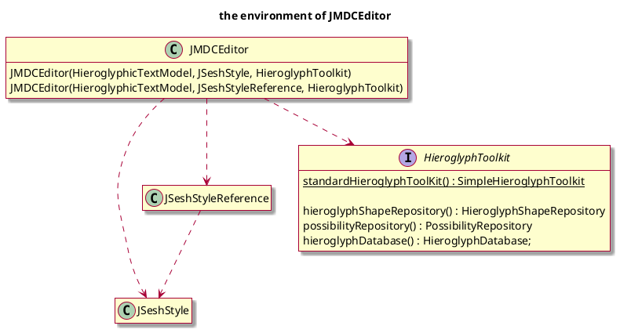
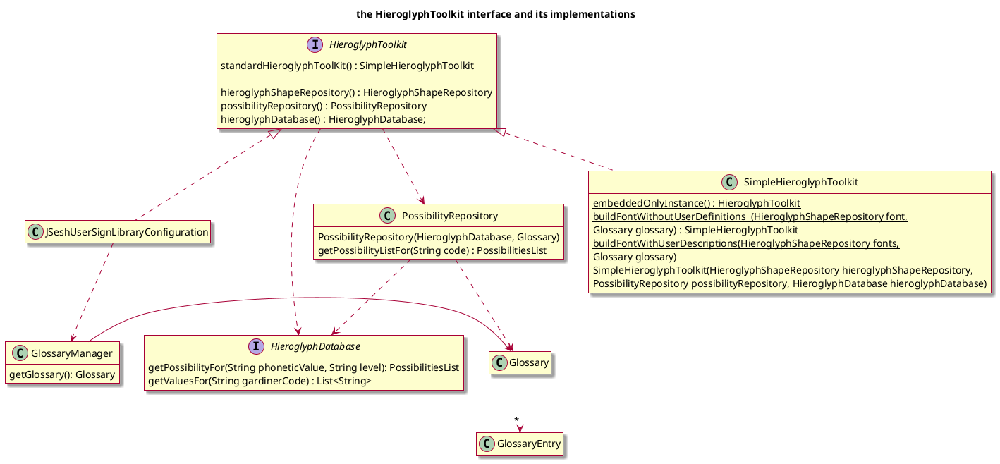

# Access to resources (Hieroglyphs and their characteristics) in JSesh

## The problem

JSesh needs to access various resources about hieroglyphs, in particular:

- font-like resources (currently, access to intances of the `ShapeChar` class) ;
- code-oriented resources, coupled with more general information about the signs ;
- so-called “glossary” : mapping from transliteration to whole sequences of signs, used dynamically for autocompletion.

Those resources may come from different sources:

- embedded with JSesh (with various formats);
- user-defined.

If one wants to use JSesh as a library, it's relatively likely that some specific font resources will be provided. It's relatively logical that JSesh user preferences and preferences for third party applications might use different sources for fonts, or mix them. So we want to be versatile.

Some parts of JSesh use only one or two of those resources, other use all three; it's in particular the case of the Swing components.

During the last refactoring, a large part of our work has been to isolate those responsabilities and to avoid the use of singleton which prevalent in version 7 of JSesh (and in previous versions).

But in some cases, we have added factories in a rather ad-hoc way, and there are too many ways to create the resources, which is confusing to programmers (even for us!)

Our goal is to unify the systems, while preserving flexibility - in particular, we want new sources of signs shapes to be easy to add, and we envision the possibiltity of having “signs libraries” to manage different sets of signs (say, Old Kingdom signs vs. New Kingdom vs. Ptolemaic).

## The current state of affairs

*(updated 2026-07-09 against the current source tree — see [[20260709-resources]] for the full picture)*

```plantuml
@startuml HieroglyphShapeRepository
skin rose
hide empty members
title the HieroglyphShapeRepository interface and its implementations

class JSeshRenderContext <<record>> {
    jseshStyle : JSeshStyle  
    hieroglyphShapeRepository: HieroglyphShapeRepository 
}

JSeshRenderContext ..> HieroglyphShapeRepository

interface CanonicalCode {}

interface HieroglyphCodesSource {
    hasCode(code : CanonicalCode): boolean
    getCodes() : Set<String>
}

HieroglyphCodesSource ..> CanonicalCode

interface HieroglyphShapeRepository extends HieroglyphCodesSource{
    get(CanonicalCode code): ShapeChar
    getSmallBody(CanonicalCode code): ShapeChar
    hasNewSigns(): boolean
    {static} getStandardShapeRepository(): HieroglyphShapeRepository
    addListener(ObservableEventListener<HieroglyphShapeRepositoryChangedEvent>)
    removeListener(ObservableEventListener<HieroglyphShapeRepositoryChangedEvent>)
}

HieroglyphShapeRepository ..> HieroglyphShapeRepositoryChangedEvent

class HieroglyphShapeRepositoryChangedEvent {}

class StandardFontShapeRepository <<package local>> implements HieroglyphShapeRepository {}

class DirectoryHieroglyphShapeRepository implements HieroglyphShapeRepository {}


interface HieroglyphToolkit {
    {static} standardHieroglyphToolKit() : SimpleHieroglyphToolkit

    hieroglyphShapeRepository() : HieroglyphShapeRepository     
    possibilityRepository() : PossibilityRepository
    hieroglyphDatabase() : HieroglyphDatabase;
}


HieroglyphToolkit ..> HieroglyphDatabase

HieroglyphToolkit ..> PossibilityRepository

class PossibilityRepository {
    PossibilityRepository(HieroglyphDatabase, Glossary)
    getPossibilityListFor(String code) : PossibilitiesList
}

PossibilityRepository ..> HieroglyphDatabase
PossibilityRepository ..> Glossary

class JSeshUserSignLibraryConfiguration implements HieroglyphToolkit{}

class SimpleHieroglyphToolkit implements HieroglyphToolkit {
    {static}  embeddedOnlyInstance() : HieroglyphToolkit
    {static} buildFontWithoutUserDefinitions  (HieroglyphShapeRepository font,
     Glossary glossary) : SimpleHieroglyphToolkit
    {static} buildFontWithUserDescriptions(HieroglyphShapeRepository fonts,
            Glossary glossary)
    SimpleHieroglyphToolkit(HieroglyphShapeRepository hieroglyphShapeRepository,
            PossibilityRepository possibilityRepository, HieroglyphDatabase hieroglyphDatabase)
}

class PredefinedFonts <<utility>> {
    {static}standardJSeshFont() :  HieroglyphShapeRepository 
    {static}  gnuTraceFont() : HieroglyphShapeRepository
    {static}  compositeFont() : CompositeHieroglyphShapeRepository
}


interface HieroglyphDatabase {
    getPossibilityFor(String phoneticValue, String level): PossibilitiesList 
    getValuesFor(String gardinerCode) : List<String> 

}

class HieroglyphDatabaseFactory <<utility>> {
    {static} buildWithUserDefinitions(HieroglyphCodesSource) : HieroglyphDatabase
    {static} buildPlainDefault(HieroglyphCodesSource) : HieroglyphDatabase
}

class DefaultHieroglyphDatabase implements HieroglyphDatabase {}

HieroglyphDatabaseFactory ..> DefaultHieroglyphDatabase

class GlossaryManager {
    getGlossary(): Glossary
}

class Glossary {

}

class GlossaryEntry {}

Glossary --> "*" GlossaryEntry 

class JMDCEditor {
    JMDCEditor(HieroglyphicTextModel, JSeshStyle, HieroglyphToolkit)
    JMDCEditor(HieroglyphicTextModel, JSeshStyleReference, HieroglyphToolkit)
}

JMDCEditor ..> JSeshStyle
JMDCEditor ..> JSeshStyleReference
JMDCEditor ..> HieroglyphToolkit

class JSeshStyleReference {}

JSeshStyleReference ..> JSeshStyle

JSeshUserSignLibraryConfiguration ..> GlossaryManager
JSeshUserSignLibraryConfiguration ..> HieroglyphDatabaseFactory

SimpleHieroglyphToolkit ..> HieroglyphDatabaseFactory

class JSeshFullHieroglyphShapeRepository implements HieroglyphShapeRepository  {
    setDirectory(File directory)
}

JSeshFullHieroglyphShapeRepository ..> DirectoryHieroglyphShapeRepository

GlossaryManager -> Glossary

PredefinedFonts ..>  HieroglyphShapeRepository
@enduml
```

- the `compositeFont` method of `PredefinedFonts` returns a tuned-down version of the composite, which doesn't contain the user font. The naming is not very good.
- ~~the “J” in `JSeshGlossary` is a bit missleading. It can suggest that it's a graphical component, but it's only “a glossary for JSesh” - and it's not really a glossary~~**fixed, renamed to Glossary**
- the responsabilities of `GlossaryManager` are not clear ; it's a factory and a I/O class.
- **new (2026-07-09):** `HieroglyphShapeRepository`/`HieroglyphCodesSource` no longer take raw `String` codes; they now take a `CanonicalCode` value type, addressing the normalisation concern noted below in “First proposal”.
- **new (2026-07-09):** `PossibilityRepository` is no longer an empty interface: it is now a concrete class built from a `HieroglyphDatabase` and a `Glossary`, and `SimpleHieroglyphToolkit` no longer depends on `GlossaryManager` (it depends on `Glossary` directly). Both `SimpleHieroglyphToolkit` and `JSeshUserSignLibraryConfiguration` now build their `HieroglyphDatabase` through a new `HieroglyphDatabaseFactory`.
- **new (2026-07-09):** `JMDCEditor` gained a constructor taking a `JSeshStyleReference` (an observable indirection over `JSeshStyle`), and `JSeshFullHieroglyphShapeRepository.setDirectory` now delegates to a new `DirectoryHieroglyphShapeRepository`.
- **not yet done:** the `JSeshCompendiumLoader` / `HieroglyphCompendium` refactor proposed below has not been implemented.

## Bugs and problems

- `HieroglyphDatabaseFactory.buildPlainDefault` loads user signs (to check) ; its documentation is not clear
  (in fact, it reads the user description of signs but doesn't allow user specific signs.)

- the documentation is not clear about what should *normally* be a singleton, and what is **structurally** a singleton. E.g. the value returned by `SimpleHieroglyphicToolkit.embeddedOnlyInstance()`. In this respect, the names of named constructors should be more explicit to differentiate them from singleton accessors.

### I/O in constructors

The following constructors perform I/O operations.

- `JSeshUserSignLibraryConfiguration`
- `GlossaryManager`
- `JSeshFullHieroglyphShapeRepository`

It's bad for testability.

On the other hand, the main purporse of those classes is to manage access to those precise resources.

## First proposal

### Remarks

- `JSeshUserSignLibraryConfiguration` is a long name, and the class is often used.
- Accessors names are not coherent. With and without `get`.

### TODO

1.  Remove `SimpleFontKit.embeddedOnlyInstance()` and `PredefinedFonts.compositeFont()`
2. hide the constructors of `SimpleHieroglyphToolkit`, and keep only one constructor, which takes the three resources as parameters.
3. Rename `JSeshUserSignLibraryConfiguration` into something shorter.
4. use the builder pattern :
~~~java
public class JSeshCompendiumLoader {
    public JSeshCompendiumLoader userFontDirectory(File dir)        { ... }
    public JSeshCompendiumLoader userGlossaryFile(File f)           { ... }
    public JSeshCompendiumLoader userSignDefinitions(File xml)      { ... }
    public HieroglyphCompendium build();

    public static HieroglyphCompendium loadDefaultFromUserPreferences();
    public static HieroglyphCompendium embeddedOnly();
}
~~~
5. transform `HieroglyphicToolkit` into a record:
~~~java
public record HieroglyphicToolkit(
        HieroglyphShapeRepository shapes,
        HieroglyphDatabase        database,
        PossibilityRepository     possibilities,
        Optional<GlossaryManager> glossary) {}
~~~

### Next steps

- Fuse JSeshRenderContext and HieroglyphicToolkit. To drawn one must extract the HieroglyphShapeRepository and pass with a JSeshStyle in a render context.

### Resulting API

~~~java
// scénario A — embedded (test, server, démo)
HieroglyphCompendium kit = JSeshCompendiumLoader.embeddedOnly();
JMDCField field = new JMDCField(320, 50, kit);

// scénario B — application JSesh standard
HieroglyphCompendium kit =
    JSeshCompendiumLoader.loadDefaultFromUserPreferences();
JMDCEditor editor = new JMDCEditor(model, JSeshStyle.DEFAULT, kit);

// scénario C — contrôle fin (test, déploiement spécifique)
HieroglyphCompendium kit = new JSeshCompendiumLoader()
        .userFontDirectory(tempDir)
        .userSignDefinitions(customXml)
        .build();
~~~

## Second analysis

- regarding `HieroglyphToolkit`, we have two independant axis:
  - glyph shapes;
  - glyph code database.

- some toolkits are created from `HieroglyphToolkit`, others from `SimpleHieroglyphToolkit`. 
  - Creation should be unified (by methods in `HieroglyphToolkit`)
  - the status (singleton or not) should be clear.
- `StandardFontShapeRepository` is not a good candidate for a singleton.
- remove “Font” from `buildFontWithoutUserDefinitions` and the like.

Use a static factory to add a user font to the standard fonts.

~~~java
// HieroglyphToolkit.java — new static factory
static HieroglyphToolkit withFont(HieroglyphShapeRepository customFont) {
    CompositeHieroglyphShapeRepository repo = new CompositeHieroglyphShapeRepository();
    repo.addHieroglyphicFontManager(customFont);
    repo.addHieroglyphicFontManager(PredefinedFonts.standardJSeshFont());
    repo.addHieroglyphicFontManager(PredefinedFonts.gnuTraceFont());
    return SimpleHieroglyphToolkit.buildWithEmbeddedDescriptions(repo, new Glossary());
}
~~~
## Final thoughts

- `PredefinedFonts.compositeFont()` is probably not needed, and not well placed. It's not a real predefined font.

