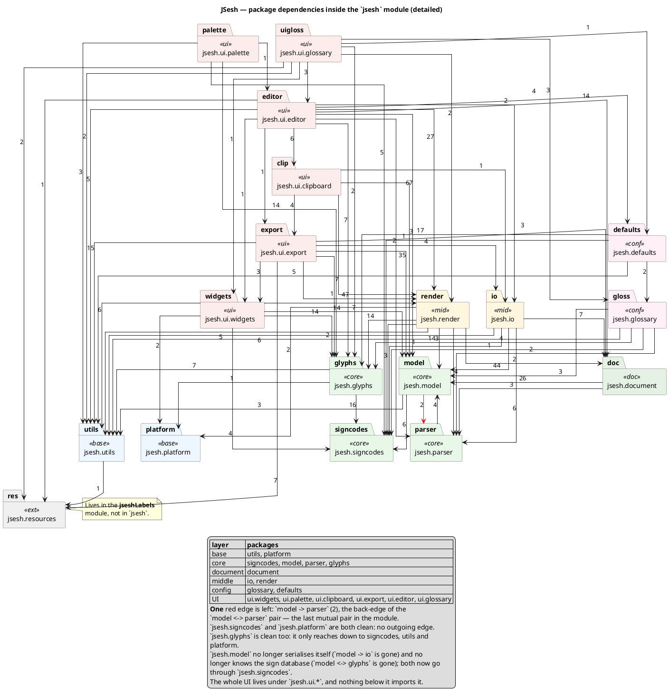
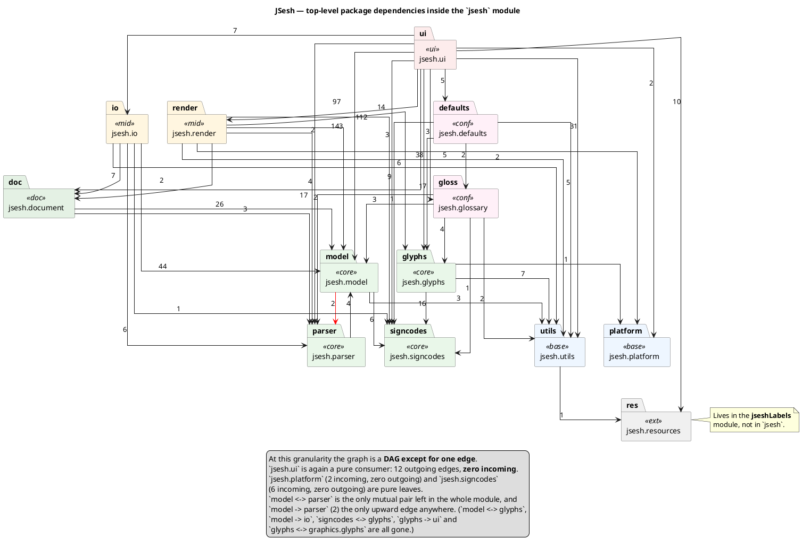
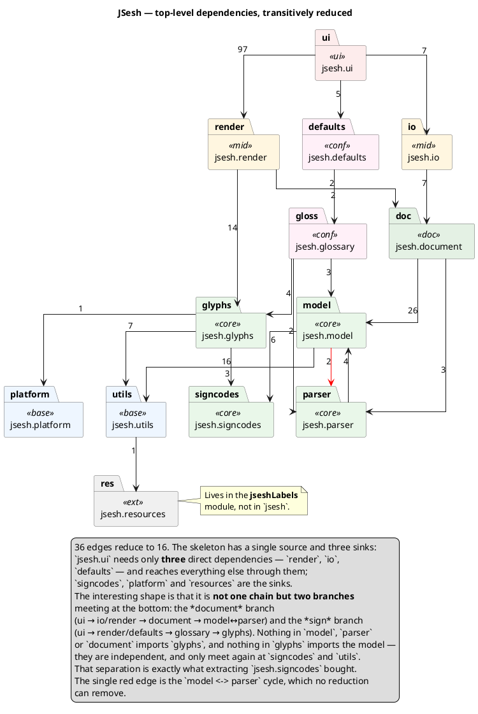

# Package dependencies inside the `jsesh` module

All three diagrams below are generated from the actual `import` statements found
in `jsesh/src/main/java` (2026-07-21). Edge labels = number of import
statements.

- The **first** diagram is the detailed one: `jsesh.ui` is broken down into its
  six sub-packages.
- The **second** is the bird's-eye view: only top-level `jsesh.*` packages,
  with the whole UI collapsed into a single `jsesh.ui` node.
- The **third** is the second one with all transitive edges removed — the
  architecture's skeleton, useful for seeing the layering at a glance rather
  than for looking up who imports what.

Conventions: solid arrows are dependencies going *downwards* (the intended
direction); red arrows go *upwards* — a lower layer depending on a higher one.

## 1. Detailed view

## 2. Top-level view

## 3. Top-level view, transitively reduced

Same data as §2, with every **transitive** edge removed: if `a -> b` and
`b -> c` are present, the shortcut `a -> c` is dropped, since it tells us
nothing the two others didn't already. What is left is the *skeleton* of the
architecture — 16 edges instead of 36.

Two remarks on method:

- `model` and `parser` import each other, so they are not orderable; they form
  a strongly connected component. The reduction is computed on the graph where
  that pair is treated as a **single node**, then expanded again for drawing.
  This is why both `document -> model` and `document -> parser` survive: the
  reduction can only say "`document` depends on the model/parser knot", not on
  which half.
- Edge labels are still the raw import counts, so a reduced edge carries the
  same number as in §2. Note how *large* some of the dropped shortcuts are:
  `render -> model` is 143 imports and `ui -> model` 112, yet both are
  redundant — `render` and `ui` already reach `model` through `document`.
  Transitivity says nothing about how heavily a package is used, only that a
  path already exists.

## History of the clean-up

**Renamings / moves**

| before | after |
|---|---|
| `jsesh.swing` | `jsesh.ui.widgets` |
| `jsesh.editor` | `jsesh.ui.editor` |
| `jsesh.clipboard` | `jsesh.ui.clipboard` |
| `jsesh.graphics.export` | `jsesh.ui.export` |
| `jsesh.glossary` (mixed) | `jsesh.glossary` (model) + `jsesh.ui.glossary` (UI) |
| `jsesh.defaults.PredefinedFonts` | `jsesh.glyphs.fonts.PredefinedFonts` |
| Gardiner-code core (was under `jsesh.glyphs`) | `jsesh.signcodes` (GardinerCode, ManuelDeCodage, CanonicalCode, HieroglyphCodesSource) |
| `jsesh.graphics.glyphs` | merged into `jsesh.glyphs` (bzr fonts included) |
| `resources/jsesh/glyphs/resources/basicGardinerCodes.txt` | `resources/jsesh/signcodes/basicGardinerCodes.txt` |
| — | `jsesh.ui.palette` (new) |

**Layering violations fixed** (edges that no longer exist)

- `glyphs -> ui.widgets` (was 1, red) — a javadoc-only `{@link}` in
  `UserSignWriter`, and then the orphaned `import` that survived the `{@link}`'s
  removal. Both are gone; `jsesh.glyphs` no longer references the UI in any
  form, and `jsesh.ui` is once more a pure consumer.
- `signcodes -> glyphs` (was 1, red) — `ManuelDeCodage` read its Gardiner-code
  list through `jsesh.glyphs.resources.EmbeddedGlyphsPathResources`, which was
  the only thing keeping `signcodes` from being a leaf. The resource file moved
  to `src/main/resources/jsesh/signcodes/`, `ManuelDeCodage` opens it itself
  with a private `getBasicGardinerCodes()`, and the now-unused accessor was
  dropped from `EmbeddedGlyphsPathResources`. Note the resources caveat: the
  stream is resolved relative to the class's package, so the `.txt` had to
  move together with its reader.
- `model -> io` (was 3, red) — the document model no longer reaches up into
  serialisation. This was one of the two red edges left in the previous
  revision.
- `model <-> glyphs` (was `model -> glyphs` 6 and `glyphs -> model` 2) — the
  Gardiner-code identity classes moved out of `jsesh.glyphs` into the new
  `jsesh.signcodes` package, which both `model` and `glyphs` now depend on
  *downwards*. The two used to be a mutual pair; they no longer import each
  other at all.
- `glyphs <-> graphics.glyphs` — `jsesh.graphics.glyphs` was folded into
  `jsesh.glyphs`, so both directions of that pair vanished.
- `render -> editor`, `swing -> editor`, `swing -> defaults`,
  `defaults -> editor`, `export -> editor`, `utils -> platform`.
- `io -> ui.export` — `PDFExportConstants` moved to `jsesh.io.constants`, so
  the PDF exporter and the PDF importer both import it downwards.
- `glyphs -> render`.
- `glyphs -> defaults` — `ExternalSignImporterModel` used exactly one method
  of `UserFontDirectoryManager`, so that method became the one-method
  interface `jsesh.glyphs.signsource.UserSignWriter`, which
  `UserFontDirectoryManager` implements. `ui.widgets -> defaults` went away
  with it, and the application modules were untouched: they still pass a
  `UserFontDirectoryManager`, which simply satisfies the interface.
  This deliberately keeps the app-scoped, preference-touching class *out* of
  `jsesh.glyphs`: no file under `jsesh/glyphs/` references `java.util.prefs`,
  and embedders can supply their own writer.
- `render -> defaults` — `PredefinedFonts` was not app-scoped at all (it only
  wrapped four `jsesh.glyphs.fonts` classes), so it moved *down* into
  `jsesh.glyphs.fonts` rather than its caller moving up. `jsesh.defaults` is
  left holding only genuine app-scoped assembly.

**Watch out for javadoc-only imports.** Importing a class purely to shorten a
`{@link}` creates a real edge in this graph even though no code depends on it.
It happened twice. `PredefinedFonts` briefly reintroduced `glyphs -> defaults`
that way, and `jsesh.glyphs.signsource.UserSignWriter` then imported
`jsesh.ui.widgets.signimportdialog.ExternalSignImporterModel` solely for a
`{@link}` — reintroducing `glyphs -> ui.widgets`, the very edge the
`UserSignWriter` interface had been extracted to remove. There is a second
half to the lesson: deleting the `{@link}` is not enough, since the `import`
outlives it and keeps the edge alive. Both are now fully cleaned up.

**Layering violations remaining** (1 red edge)

- `model -> parser` (2) — the core model still reaches up into parsing
  (`jsesh.model.tools.MDCCodeExtractor` runs `MDCParserFacade`). This is the
  one knot left, and the only mutual pair still in the module. Everything else
  in `jsesh` now points strictly downwards.
