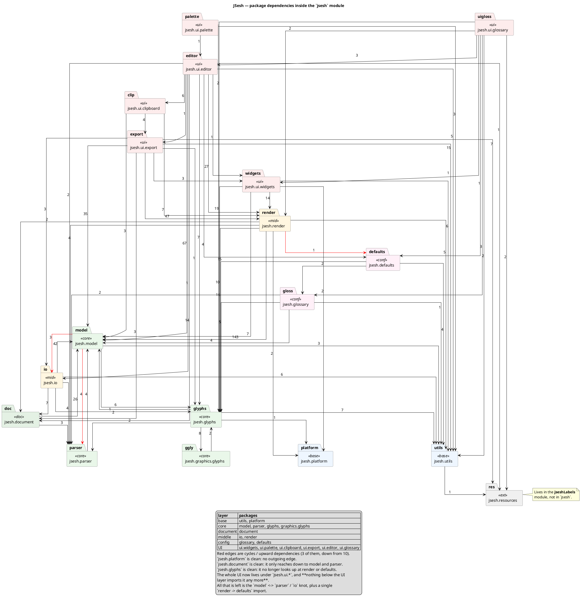

## What changed since the previous version

**Renamings / moves**

| before | after |
|---|---|
| `jsesh.swing` | `jsesh.ui.widgets` |
| `jsesh.editor` | `jsesh.ui.editor` |
| `jsesh.clipboard` | `jsesh.ui.clipboard` |
| `jsesh.graphics.export` | `jsesh.ui.export` |
| `jsesh.glossary` (mixed) | `jsesh.glossary` (model) + `jsesh.ui.glossary` (UI) |
| — | `jsesh.ui.palette` (new) |

**Layering violations fixed** (edges that no longer exist)

- `render -> editor`
- `swing -> editor`, `swing -> defaults`
- `defaults -> editor`
- `export -> editor`
- `utils -> platform`
- `io -> ui.export` — `PDFExportConstants` moved to `jsesh.io.constants`, so
  the PDF exporter and the PDF importer now both import it downwards. This
  was the last UI reference below the UI layer.
- `glyphs -> render`
- `glyphs -> defaults` — `ExternalSignImporterModel` used exactly one method
  of `UserFontDirectoryManager`, so that method became the one-method
  interface `jsesh.glyphs.signsource.UserSignWriter`, which
  `UserFontDirectoryManager` implements. `ui.widgets -> defaults` went away
  with it, and the app modules were untouched: they still pass a
  `UserFontDirectoryManager`, which now simply satisfies the interface.
  This deliberately keeps the app-scoped, preference-touching class *out* of
  `jsesh.glyphs` — no file under `jsesh/glyphs/` references
  `java.util.prefs`, and embedders can supply their own writer.

**Layering violations remaining** (3 red edges)

- `model -> parser` (4) and `model -> io` (3) — the core model still reaches
  up into parsing and serialisation. This is the substantial one left.
- `render -> defaults` (1).
