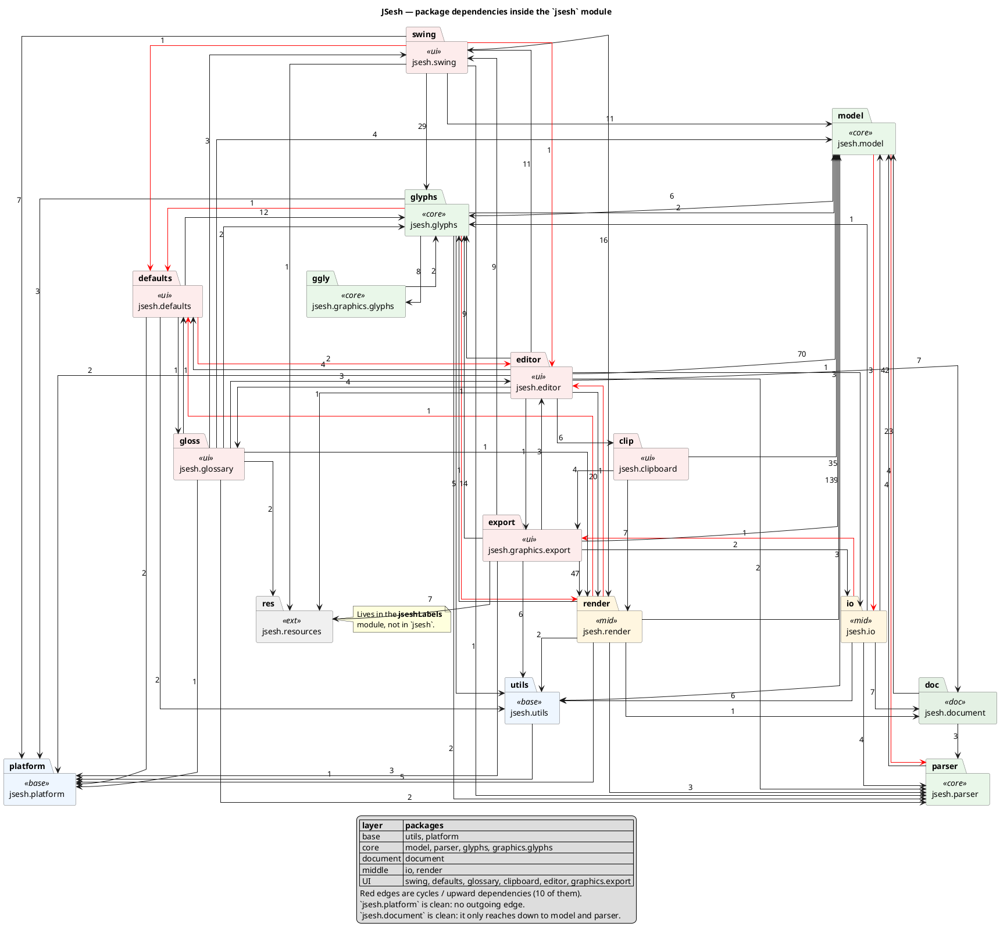

```plantuml
@startuml jsesh-package-dependencies
'
' Dependencies between the top-level packages of the `jsesh` module.
'
' Generated from the actual `import` statements found in
' jsesh/src/main/java (2026-07), after `jsesh.document` was extracted
' from `jsesh.io.document` and `jsesh.editor`.
' Edge labels = number of import statements.
'
' Solid arrows  = dependency going "downwards" (intended direction).
' Red arrows    = dependency going "upwards" (layering violation:
'                 a lower layer depends on a higher one).
'
title JSesh — package dependencies inside the `jsesh` module

skinparam packageStyle rectangle
skinparam shadowing false
skinparam linetype ortho
skinparam package {
  BackgroundColor<<base>>   #EEF6FF
  BackgroundColor<<core>>   #E9F7E9
  BackgroundColor<<doc>>    #E4F1E4
  BackgroundColor<<mid>>    #FFF6E0
  BackgroundColor<<ui>>     #FDECEC
  BackgroundColor<<ext>>    #F0F0F0
  BorderColor #666666
}

package "jsesh.utils"           as utils    <<base>>
package "jsesh.platform"        as platform <<base>>

package "jsesh.model"           as model    <<core>>
package "jsesh.parser"          as parser   <<core>>
package "jsesh.glyphs"          as glyphs   <<core>>
package "jsesh.graphics.glyphs" as ggly     <<core>>

package "jsesh.document"        as doc      <<doc>>

package "jsesh.io"              as io       <<mid>>
package "jsesh.render"          as render   <<mid>>

package "jsesh.swing"           as swing    <<ui>>
package "jsesh.defaults"        as defaults <<ui>>
package "jsesh.glossary"        as gloss    <<ui>>
package "jsesh.clipboard"       as clip     <<ui>>
package "jsesh.editor"          as editor   <<ui>>
package "jsesh.graphics.export" as export   <<ui>>

package "jsesh.resources" as res <<ext>>
note right of res
  Lives in the **jseshLabels**
  module, not in `jsesh`.
end note

' ---------------------------------------------------------------- base layer
' `jsesh.platform` has no outgoing dependency at all: it is a pure leaf.
utils -->  platform                   : 1

' ---------------------------------------------------------------- core layer
model  -->        utils               : 3
model  -->        glyphs              : 6
model  -[#red]->  parser              : 4
model  -[#red]->  io                  : 3

parser -->        model               : 4

glyphs -->        model               : 2
glyphs -->        parser              : 2
glyphs -->        platform            : 3
glyphs -->        utils               : 5
glyphs -->        ggly                : 8
glyphs -[#red]->  render              : 1
glyphs -[#red]->  defaults            : 1

ggly   -->        glyphs              : 2

' ------------------------------------------------------------ document layer
' `jsesh.document` holds MDCDocument, DocumentPreferences,
' HieroglyphicTextModel and the undo machinery. It is shared by `io`
' (which serialises it) and `editor` (which edits it), and depends on
' nothing but the model and the parser.
doc    -->        model               : 23
doc    -->        parser              : 3

' ---------------------------------------------------------------- middle layer
render -->        model               : 139
render -->        glyphs              : 14
render -->        parser              : 3
render -->        platform            : 5
render -->        utils               : 2
render -->        doc                 : 1
render -[#red]->  editor              : 1
render -[#red]->  defaults            : 1

io     -->        model               : 42
io     -->        doc                 : 7
io     -->        utils               : 6
io     -->        parser              : 4
io     -->        glyphs              : 1
io     -[#red]->  export              : 1

' ---------------------------------------------------------------- UI layer
swing  -->        model               : 11
swing  -->        glyphs              : 29
swing  -->        parser              : 1
swing  -->        render              : 16
swing  -->        platform            : 7
swing  -->        res                 : 1
swing  -[#red]->  editor              : 1
swing  -[#red]->  defaults            : 1

defaults --> glyphs                   : 12
defaults --> platform                 : 2
defaults --> utils                    : 2
defaults --> gloss                    : 1
defaults -[#red]-> editor             : 2

gloss  --> model                      : 4
gloss  --> parser                     : 2
gloss  --> glyphs                     : 2
gloss  --> render                     : 1
gloss  --> platform                   : 1
gloss  --> swing                      : 3
gloss  --> res                        : 2
gloss  --> defaults                   : 1
gloss  --> editor                     : 3

clip   --> model                      : 3
clip   --> render                     : 7
clip   --> export                     : 4

editor --> model                      : 70
editor --> render                     : 20
editor --> swing                      : 11
editor --> glyphs                     : 9
editor --> doc                        : 7
editor --> clip                       : 6
editor --> defaults                   : 4
editor --> gloss                      : 4
editor --> parser                     : 2
editor --> platform                   : 2
editor --> io                         : 1
editor --> export                     : 1
editor --> res                        : 1

export --> render                     : 47
export --> model                      : 35
export --> swing                      : 9
export --> res                        : 7
export --> utils                      : 6
export --> editor                     : 3
export --> platform                   : 3
export --> io                         : 2
export --> glyphs                     : 1

legend bottom
  |= layer |= packages |
  | base     | utils, platform |
  | core     | model, parser, glyphs, graphics.glyphs |
  | document | document |
  | middle   | io, render |
  | UI       | swing, defaults, glossary, clipboard, editor, graphics.export |
  Red edges are cycles / upward dependencies (10 of them).
  `jsesh.platform` is clean: no outgoing edge.
  `jsesh.document` is clean: it only reaches down to model and parser.
endlegend
@enduml
```
