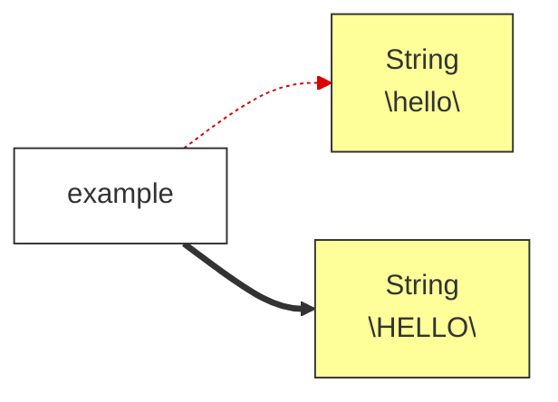

# 1. JSesh `jsesh` module — Programmer Documentation


**Warning**: JSesh 8 is a major rewrite, still in beta. I have changed the API a lot, and it's likely that I update it again before making it permanent. So, *please*, experiment with this API, contact me to report problems and suggestions, but consider that the code you write with will need to be updated soon enough.


This document describes how to *use* the `jsesh` core library from your own Java code. It is organised around concrete use cases rather than around the package layout. For the internal architecture and package roots, see [jsesh packages dependencies](jsesh-package-dependencies.html) and the package-info files inside the module.

The demo applications in [JSeshDemos](https://github.com/rosmord/jseshDemos) give examples of how to use the library.

The `jsesh` module is a **library**: it has no `main`. The end-user application lives in `jseshAppli`. Everything below can be embedded in a servlet, a batch tool, a desktop app, or a test.

## Contents <!-- omit from toc -->

- [1. Companion project](#1-companion-project)
- [2. Set up](#2-set-up)
- [3. Use in your project](#3-use-in-your-project)
- [4. Core concepts and vocabulary](#4-core-concepts-and-vocabulary)
- [5. Building objects with *Construction Builders*](#5-building-objects-with-construction-builders)
- [6. Use case: render hieroglyphs to an image or a `Graphics2D`](#6-use-case-render-hieroglyphs-to-an-image-or-a-graphics2d)
  - [6.1. Quickest possible — a PNG from MdC](#61-quickest-possible--a-png-from-mdc)
  - [6.2. Drawing onto an existing `Graphics2D`](#62-drawing-onto-an-existing-graphics2d)
  - [6.3. Building the facade explicitly](#63-building-the-facade-explicitly)
- [7. Use case: build a computer representation of a Manuel de Codage text](#7-use-case-build-a-computer-representation-of-a-manuel-de-codage-text)
- [8. Use case: read and write `.gly` documents](#8-use-case-read-and-write-gly-documents)
  - [8.1. Loading](#81-loading)
  - [8.2. Saving to MdC](#82-saving-to-mdc)
- [9. Use case: turn a model back into MdC text](#9-use-case-turn-a-model-back-into-mdc-text)
- [10. Use case: embed the interactive editor in a Swing app](#10-use-case-embed-the-interactive-editor-in-a-swing-app)
- [11. Use case: query the sign database](#11-use-case-query-the-sign-database)
- [12. Use case: convert hieroglyphs to Unicode](#12-use-case-convert-hieroglyphs-to-unicode)
- [13. Use case: export to PDF, SVG, RTF, EMF…](#13-use-case-export-to-pdf-svg-rtf-emf)
- [14. Use case: walk or transform a model](#14-use-case-walk-or-transform-a-model)
- [15. Resources, fonts and the sign database — how to build them](#15-resources-fonts-and-the-sign-database--how-to-build-them)
  - [15.1. HieroglyphResources](#151-hieroglyphresources)
  - [15.2. Glossary](#152-glossary)
  - [15.3. Default user font directory](#153-default-user-font-directory)
  - [15.4. Fully custom build, accessing all resources of the JSesh Application](#154-fully-custom-build-accessing-all-resources-of-the-jsesh-application)
- [16. Quick reference: key entry points](#16-quick-reference-key-entry-points)

---
## 1. Companion project

The [JSeshDemos](https://github.com/rosmord/jseshDemos) project contains a number of small demo application which give examples of library usage and configuration.

I strongly recommand you to get them.


## 2. Set up

As of today, the JSesh 8 libraries are not yet published to Maven Central. You can build and install them locally:

~~~bash
# clone the repository
git clone https://github.com/rosmord/jsesh.git
# (optional) check out a specific release
# git checkout TAG (not needed currently)
cd jsesh
# build and publish to maven local repository (~/.m2/repository)
./gradlew publishToMavenLocal
~~~

## 3. Use in your project

JSesh defines a number of modules you might be interested in. You will probably need `jsesh`, which is the core library, and `jseshGlyphs` if you want the extended glyphs library.

Currently, depending on your system, you would use :

**for gradle**:

~~~gradle

ext {
    jseshVersion = "8.0.5-SNAPSHOT" // (see below)
    .....
}

repositories {
    mavenLocal() // Hopefully the jsesh library is there.
    mavenCentral()    
}


dependencies {
    implementation "org.qenherkhopeshef.jsesh:jsesh:${jseshVersion}"
    implementation "org.qenherkhopeshef.jsesh:jseshGlyphs:${jseshVersion}"
    ...
}
~~~

To know the current version number of the JSesh library you have installed, look at the `gradle.properties` file at the root of the jsesh repository.

Currently, it starts like this:

~~~properties
version=8.0.5-SNAPSHOT
javaToolchainVersion=21
~~~

`version` is the jsesh version number.

## 4. Core concepts and vocabulary

**Manuel de Codage (MdC)** is the plain-text encoding for Egyptian hieroglyphs
(e.g. `i-w-r:a-ra-m-p*t:pt`). JSesh reads, edits, renders and writes MdC.

Three data types represent hieroglyphic texts, with increasing richness:

| Type | What it is | Where |
|---|---|---|
| `TopItemList` | The **actual hieroglyphic text**: a tree of hieroglyphs, cadrats, cartouches, line breaks… This is the in-memory representation of a text. | `jsesh.model.TopItemList` |
| `MDCDocument` | A `TopItemList` **plus** file metadata (path, encoding, dialect, preferences). What you load from / save to disk. | `jsesh.document.MDCDocument` |
| `HieroglyphicTextModel` | A **live, observable, undoable** wrapper around a `TopItemList`, used by the editor. | `jsesh.document.HieroglyphicTextModel` |

Rule of thumb:

- Batch / server code that only transforms text → work with `TopItemList`.
- Loading and saving files → `MDCDocument`.
- Anything interactive (an editor, undo/redo, change notification) → `HieroglyphicTextModel`.

**Rendering** always needs two contexts:

- a `JSeshRenderContext` — *what* to draw with (style + a font/shape repository),
- a `JSeshTechRenderContext` — *where* to draw (the `Graphics2D`, device scale).

The `MDCDrawingFacade` (see §3) hides both for the common cases.

---

## 5. Building objects with *Construction Builders*

We had problems in the previous versions because some objects, in particular instances of the class `DrawingSpecification` were *mutable*. Their values could be modified, and it was a problem when those objects were **shared** among various components (for instance, the editor and the Group editor).

Tracking the relationships between those was difficult.

**JSesh 8** follows the “modern” practice of favouring **immutable objects**. Actually, it's not that modern, because it has been used in [functional programming](https://en.wikipedia.org/wiki/Functional_programming) for a long time, but since the 2010's, it's becoming more and more mainstream in object-oriented programming.

Hence, some objects, such as `JSeshStyle` are now **immutable** (using **records**). When you need a modified version of an immutable object, you simply create a new instance. That's exactly what happens with strings in Java. If you want to pass a string to uppercase, you would actually create a new string, and the original string would remain unchanged.

~~~java
String example = "Hello";
String upper = example.toUpperCase(); // creates a new string, example is unchanged
~~~

It doesn't make **references** immutable, as in the following example:

~~~java
String example = "Hello";
String example = example.toUpperCase();
~~~

Here, `example`, which formerly pointed to the string `"Hello"`, points to  `"HELLO"`.




For composite objects, such as `JSeshStyle`, it means that the basic way to create a modified version of the object is to re-create a new instance.

~~~java
JSeshStyle style = JSeshStyle.DEFAULT;
// New painting specifications
PaintingSpecifications newPainting = ...;
// create a new style with a modified value
JSeshStyle style = new JSeshStyle(
  style.geometry(),
  newPainting,
  style.fonts(),
  style.options());
~~~

It's not very convenient. Hence the use of a pattern which **Martin Fowler** calls the **Construction Builder** pattern.


It may seem more complex than the old system, but now sharing mutable objects is explicit instead of implicit. `JSeshStyle` objects are immutable. You can use the same instance in various places without problem. If you replace one of the values, the other will remain unchanged. 

If you want to **synchronize** values (e.g. to use the same style in all of your editors), the `JSeshStyleReference` is there for you.


---

## 6. Use case: render hieroglyphs to an image or a `Graphics2D`

`jsesh.render.draw.MDCDrawingFacade` is the "one class for programmers who just
want to draw hieroglyphs". It accepts either an MdC `String` or a `TopItemList`.

### 6.1. Quickest possible — a PNG from MdC

```java
import jsesh.render.draw.MDCDrawingFacade;
import java.awt.image.BufferedImage;
import javax.imageio.ImageIO;
import java.io.File;

MDCDrawingFacade facade = MDCDrawingFacade.buildDefault();
facade.setCadratHeight(40);                 // approx. height of a quadrat, in px
BufferedImage img = facade.createImage("i-w-r:a-ra-m-p*t:pt");
ImageIO.write(img, "png", new File("word.png"));
```

`buildDefault()` uses the embedded font and the default style. **Caveat:** it does
*not* include the user's own signs — for that, build the facade from a
`JSeshRenderContext` you assemble yourself (see §11).

### 6.2. Drawing onto an existing `Graphics2D`

Useful when compositing hieroglyphs into a larger drawing (a report, a custom
component, another exporter):

```java
// g is a Graphics2D; x, y the top-left target point.
Rectangle2D bounds = facade.draw("nfr-nfr-nfr", g, x, y);
// bounds tells you the box that was drawn, for layout.
```

`getBounds(...)` computes the same box **without** drawing, so you can size a
component or lay out a page first.

### 6.3. Building the facade explicitly

```java
import jsesh.render.context.JSeshRenderContext;
import jsesh.render.style.JSeshStyle;
import jsesh.glyphs.fonts.PredefinedFonts;

JSeshRenderContext ctx =
    new JSeshRenderContext(JSeshStyle.DEFAULT, PredefinedFonts.buildAllEmbeddedFonts());
MDCDrawingFacade facade = new MDCDrawingFacade(ctx);
```

Swap `JSeshStyle.DEFAULT` for a customised `JSeshStyle` to change sign spacing,
line thickness, shading, etc. Use `facade.setStyle(...)` to change it later.

Other knobs: `setDeviceScale(double)` (pixels per typographic point — raise it for
print resolution), `setMaxSize(w, h)` (caps bitmap size).

There is a runnable example in
[`jseshTests/.../MdcDrawingFacadeDemo.java`](../../jseshTests/src/main/java/jsesh/demo/drawing/MdcDrawingFacadeDemo.java).

---


## 7. Use case: build a computer representation of a Manuel de Codage text

> You have a string of MdC code, and you want to read it, in order to manipulate it (for instance to extract the list of hieroglyphs in a reliable way). The solution is to build a `TopItemList` object.

The entry point is `jsesh.mdcreader.MDCParserModelGenerator`. It returns a
`TopItemList`. (Before 2026-09-24 this class was in `jsesh.parser`. It moved
so that the parser no longer depends on the model; only the package name
changed.)

```java
import jsesh.mdcreader.MDCParserModelGenerator;
import jsesh.parser.MDCSyntaxError;
import jsesh.model.TopItemList;

MDCParserModelGenerator generator = new MDCParserModelGenerator();
try {
    TopItemList text = generator.parse("i-w-r:a-ra-m-p*t:pt");
    // ... use the model ...
} catch (MDCSyntaxError e) {
    // e.getLine() / e.getColumn() locate the problem in the input
    System.err.println("Bad MdC: " + e.getMessage());
}
```

Notes:

- `parse(String)` and `parse(Reader)` are both available.
- Pass a `Dialect` to the constructor (`new MDCParserModelGenerator(Dialect.TKSESH)`)
  to read legacy encodings. For plain modern MdC the default is fine.
- `setPhilologyAsSigns(true)` treats `[[`, `]]`, `(` … as ordinary signs instead
  of philological constructs — only needed for very old TkSesh texts.
- **Lower level:** if you don't want a `TopItemList` but the literal parse tree
  instead, use `MDCParserAstGenerator`, which returns an `AstDocument` (see
  `jsesh.parser.ast`) — a faithful, uninterpreted record of what the parser
  read, walkable with `AstVisitor`. `MDCParserModelGenerator` itself is just
  `MDCParserAstGenerator` followed by the interpretation step (folding
  toggles into red/shaded state, dropping cadrat/zone options, dialect-specific
  modifier renaming...) that turns that AST into a `TopItemList`. Both are
  backed by the same hand-written parser, `jsesh.parser.MDCParser`.
  `jsesh.parser` and its AST don't depend on `jsesh.model`: sign subtypes,
  philology kinds and toggles are stored as the lexer's own enums
  (`jsesh.parser.lexer`).

## 8. Use case: read and write `.gly` documents

Files carry more than the model: an encoding, a dialect, and document
preferences (orientation, direction…). Use `MDCDocument` with the reader/writer
in `jsesh.io.document`.

### 8.1. Loading

```java
import jsesh.io.document.MDCDocumentReader;
import jsesh.document.MDCDocument;

MDCDocumentReader reader = new MDCDocumentReader();
MDCDocument doc = reader.loadFile(new File("text.gly"));
TopItemList model = doc.getTopItemList();
```

The reader **will guess the encoding and dialect for you,** using various hints (file content, `.hie` extension, WinGlyph `@` header, MacScribe header, JSesh `++JSeshInfo` header…).
It is *forgiving*: a line it can't parse is kept verbatim as red text rather than aborting the load. Call `reader.failFast()` beforehand if instead you want a malformed file to throw `MDCSyntaxError` — e.g. when validating input.

`readString(mdc, file)` builds a document straight from an MdC string, associating it with a (future) file.

### 8.2. Saving to MdC

```java
import jsesh.io.document.MDCDocumentWriter;

new MDCDocumentWriter().write(doc);        // saves to doc.getFile()
```

Beware: `write(...)` calls `prepareForSaving(doc)`, which **normalises the
document in place** — it forces the modern JSesh dialect, UTF-8 encoding, and a
`.gly` extension (or `.hie`/iso-8859-1 when philology-as-signs is on). Variants:

- `write(doc, OutputStream)` / `write(doc, Writer)` — flush but do not close the stream (it stays the caller's).
- `toMdC(doc)` — returns the full document (header included) as a `String`.
- `toMdC(TopItemList, DocumentPreferences)` — convenience when you have a bare text and preferences but no real document.

---

## 9. Use case: turn a model back into MdC text

If you only need the MdC source of a `TopItemList` (no file header), use `jsesh.io.mdc.MdCModelWriter` directly:

```java
import jsesh.io.mdc.MdCModelWriter;
import java.io.StringWriter;

StringWriter out = new StringWriter();
new MdCModelWriter().write(out, topItemList);
String mdc = out.toString();
```

It also has `write(File, TopItemList)` and `write(String fileName, TopItemList)` overloads. When you want the header too, go through `MDCDocumentWriter.toMdC(...)`.

---

## 10. Use case: embed the interactive editor in a Swing app

`jsesh.ui.editor.JMDCEditor` is a ready-to-use Swing component (a `JComponent`).
Drop it in a `JScrollPane`:

```java
import jsesh.ui.editor.JMDCEditor;

JMDCEditor editor = new JMDCEditor();
frame.add(new JScrollPane(editor), BorderLayout.CENTER);

editor.setMDCText("i-mn:n-ra");          // load text (ignores syntax errors)
String current = editor.getMDCText();     // read it back
```

Key collaborators (you rarely touch them directly, but they exist for advanced
control):

| Class | Role |
|---|---|
| `JMDCEditorWorkflow` | The editing **state machine** — `getMDCCode()`/`setMDCCode()`, caret, undo/redo, insertion. Get it with `editor.getWorkflow()`. |
| `HieroglyphicTextModel` | The observable/undoable model behind the editor (`editor.getHieroglyphicTextModel()`). Register listeners here to react to edits. |
| `MDCEditorKeyManager` | Keyboard handling. |
| `MDCCaret` | Selection / cursor position. |

Text direction and orientation are set on the editor:
`editor.setTextDirection(TextDirection.RIGHT_TO_LEFT)`,
`editor.setTextOrientation(TextOrientation.HORIZONTAL)`.

The three-argument constructor
`JMDCEditor(HieroglyphicTextModel, JSeshStyle, HieroglyphResources)` lets you
share a model, apply a custom style, and supply your own fonts/signs (§11).

Runnable example:
[`MDCEditorDemo.java`](../../jseshTests/src/main/java/jsesh/demo/swingdemos/MDCEditorDemo.java).
For a single-line input field, see `JMDCField`.

---

## 11. Use case: query the sign database

`jsesh.glyphs.signdata.HieroglyphDatabase` answers questions about the ~6500
signs: transliterations, variants, families, tags, code completion. Get an
instance from the resources (§11):

```java
HieroglyphResources resources = HieroglyphResourcesBuilder.buildWithUserDefinitions();
HieroglyphDatabase db = resources.database();

List<String> values      = db.getValuesFor("G17");          // phonetic values of a sign
String description        = db.getDescriptionFor("A1");
Collection<SignVariant> v = db.getVariants("N35");
PossibilitiesList byValue = db.getPossibilityFor("mn", null); // signs for a phonetic value
PossibilitiesList byCode  = db.getCodesStartingWith("G1");    // code completion
Collection<String> tagged = db.getSignsWithTagInFamily("tall", "A");
```

Highlights of the interface:

- `getValuesFor`, `getDescriptionFor`, `getFamilies`, `getTagsForSign`.
- Variant navigation: `getVariants(code)`, `getVariants(code, VariantTypeForSearches)`,
  and the transitive-closure default `getTransitiveVariants(...)`.
- Search / completion: `getPossibilityFor`, `getCodesStartingWith`,
  `getSuitableSignsForCode`, `getSignsContaining`, `getSignsIn`.

The Gardiner code system itself (parsing `A1`, `G17`, phantom codes…) lives in
`jsesh.glyphs.data.coremdc` (`GardinerCode`, `ManuelDeCodage`).

---

## 12. Use case: convert hieroglyphs to Unicode

`jsesh.model.unicode.MdCToUnicodeConverter` maps a model to the Unicode
hieroglyph block (plus optional format/control characters for grouping):

```java
import jsesh.model.unicode.MdCToUnicodeConverter;

MdCToUnicodeConverter converter = new MdCToUnicodeConverter();
converter.setIncludeFormatControlChars(true);   // emit grouping controls
String unicode = converter.convertToPlainUnicode(topItemList);
```

Combine with the parser (§2) to go straight from MdC text to Unicode.

---

## 13. Use case: export to PDF, SVG, RTF, EMF…

Format exporters live under `jsesh.ui.export.*`. Each format has its own
package; they share the machinery in `jsesh.ui.export.generic`
(`GraphicalExporter`, `AbstractGraphicalExporter`, `SelectionExporter`,
`ExportData`).

| Format | Package / class |
|---|---|
| PDF (iText 2.1.5) | `jsesh.ui.export.pdfExport.PDFExporter` |
| SVG | `jsesh.ui.export.svg.SVGExporter` |
| RTF (with embedded pictures) | `jsesh.ui.export.rtf` |
| EMF / WMF (Windows metafiles) | `jsesh.ui.export.emf`, `jsesh.ui.export.wmf` |
| EPS | `jsesh.ui.export.eps` |
| Mac PICT | `jsesh.ui.export.macpict` |
| Bitmaps (PNG/JPEG) | `jsesh.ui.export.bitmaps` |
| HTML | `jsesh.ui.export.html` |

These classes mix rendering with some UI (option panels), so they are less
"pure" than the drawing facade. For a **headless bitmap** you almost always want
`MDCDrawingFacade` (§3) instead. Reach for these exporters when you need the
specific vector/clipboard format. The generic drawer walks the same
`MDCView`/`ViewDrawer` pipeline the screen uses, so output matches the editor.

The rendering pipeline underneath (should you need it directly) is:
`ViewBuilder.buildView(topItemList, renderContext, techContext)` → `MDCView`,
then `new ViewDrawer().draw(graphics, renderContext, techContext, view)`
(all in `jsesh.render.view` / `jsesh.render.draw`).

---

## 14. Use case: walk or transform a model

The model is a tree of `ModelElement`s with a **visitor** and an **observer**
pattern (see the tree in `CLAUDE.md`). To inspect or transform it, implement a
visitor rather than instanceof-chains.

- Base class: `jsesh.model.ModelElement` (every node accepts a visitor).
- Container root: `TopItemList` → `TopItem`s (`Cadrat`, `Cartouche`,
  `LineBreak`, `ZoneStart`, …); a `Cadrat` holds `HBox`es of
  `HorizontalListElement`s (`Hieroglyph`, `InnerGroup`, `ComplexLigature`).
- Structural edits and higher-level operations live in `jsesh.model.operations`.
- To be notified of changes, register on the `HieroglyphicTextModel` (§6) or on
  individual elements' observers.

`MdCToUnicodeConverter` (§8) and `MdCModelWriter` (§5) are themselves good,
readable examples of model visitors.

---

## 15. Resources, fonts and the sign database — how to build them

"Resources" bundle the three things rendering and querying need: the sign **shapes** (fonts), the sign **database** (metadata), and the **possibilities** (completion). You can access them with `jsesh.defaults.HieroglyphResourcesBuilder`, which returns a `HieroglyphResources` record containg
(`shapes()`, `database()`, `possibilities()`).

You can use simple factory methods for usual cases, or build a completely custom object.

Two information are a bit more difficult to get: the glossary and the user font directory.

### 15.1. HieroglyphResources

Ready-made factory methods cover the usual needs (you need only **one** of these):

```java
import jsesh.defaults.HieroglyphResourcesBuilder;
import jsesh.defaults.HieroglyphResources;

// Only what ships inside the jar — no user signs, no user fonts:
HieroglyphResources embedded = HieroglyphResourcesBuilder.buildEmbedded();

// Embedded fonts + the user's SignInfo definitions (signs_definition.xml):
HieroglyphResources withUser = HieroglyphResourcesBuilder.buildWithUserDefinitions();

// Everything: user font folder + user definitions + a glossary for completion.
// Use this form when you keep the DirectoryReference/GlossaryManager yourself
// (e.g. because the app also needs to edit and save them back):
HieroglyphResources full =
    HieroglyphResourcesBuilder.buildFull(userFontsDirectoryReference, glossary);

// Same, but reading the user's own JSesh preferences for you (font directory
// from UserFontDirectoryManager, glossary from GlossaryManager) — the
// convenient one-liner for embedders who just want to reuse the user's setup
// without managing those objects themselves:
HieroglyphResources fromPrefs = HieroglyphResourcesBuilder.buildFullFromUserPreferences();
```

Or build one piece at a time (font order matters — earlier fonts win):

```java
HieroglyphResources res = new HieroglyphResourcesBuilder()
        .addFontDirectory(myFontsDir)                  // user signs override…
        .addFont(PredefinedFonts.buildStandardJSeshFont())
        .addFont(PredefinedFonts.buildGnuTraceFont())  // …fallback last
        .useUserDefinitions(true)
        .glossary(myGlossary)
        .build();
```

For the database alone, `jsesh.defaults.HieroglyphDatabaseFactory` has
`buildPlainDefault(codesSource)` and `buildWithUserDefinitions(codesSource)`.

To feed resources into rendering, wrap the shape repository in a
`JSeshRenderContext` together with a `JSeshStyle` (§3). To feed them into an
editor, pass the `HieroglyphResources` to the `JMDCEditor` constructor (§6).

### 15.2. Glossary

If you need to manage the glossary (i.e. to be able to edit it using the glossary editor), you need to get it from the `GlossaryManager`. In this case, don't forget to pass it to the `HieroglyphResourcesBuilder` when you build your resources.

~~~java
// Create a glossary manager
GlossaryManager glossaryManager = new GlossaryManager();
// Read the user glossary from the JSesh app.
glossaryManager.read();
// if needed, get the glossary object.
Glossary glossary = glossaryManager.getGlossary();
~~~

### 15.3. Default user font directory

You can have multiple directories containing fonts, but if you want to access the user font directory set for JSesh, you can use the `UserFontDirectoryManager`:

~~~java
  UserFontDirectoryManager userFontDirectoryManager = UserFontDirectoryManager.buildUserFontManager();
  DirectoryReference userFontReference = userFontDirectoryManager.getUserFontReference();
~~~


### 15.4. Fully custom build, accessing all resources of the JSesh Application

If you want full control, here is a simple example:

~~~java
// Style
JSeshStyle style =
    JSeshStyle.DEFAULT.copy()
        .geometry(g -> g.scaleToHeight(40.0))
        // possibly other modifications...
    .build();
// glossary
// Create a glossary manager
GlossaryManager glossaryManager = new GlossaryManager();
glossaryManager.read();
// user font directory
UserFontDirectoryManager userFM = UserFontDirectoryManager.buildUserFontManager();

HieroglyphResources res = new HieroglyphResourcesBuilder()
        .glossary(glossaryManager.getGlossary())
        .addFontDirectoryReference(userFM.getUserFontReference())
        // other font directories if needed ?
        .addFont(PredefinedFonts.buildStandardJSeshFont())
        .addFont(PredefinedFonts.buildGnuTraceFont())
        .useUserDefinitions(true)
        .build();
~~~


---

## 16. Quick reference: key entry points

| I want to… | Use | Package |
|---|---|---|
| Parse MdC → model | `MDCParserModelGenerator.parse` | `jsesh.mdcreader` |
| Parse MdC → literal AST | `MDCParserAstGenerator.parse` | `jsesh.parser` |
| Model → MdC text | `MdCModelWriter.write` | `jsesh.io.mdc` |
| Draw hieroglyphs (image / `Graphics2D`) | `MDCDrawingFacade` | `jsesh.render.draw` |
| Load a `.gly` file | `MDCDocumentReader.loadFile` | `jsesh.io.document` |
| Save a document | `MDCDocumentWriter.write` | `jsesh.io.document` |
| Full document (model + metadata) | `MDCDocument` | `jsesh.document` |
| Editable/observable/undoable model | `HieroglyphicTextModel` | `jsesh.document` |
| Interactive Swing editor | `JMDCEditor` | `jsesh.ui.editor` |
| Query signs / variants / completion | `HieroglyphDatabase` | `jsesh.glyphs.signdata` |
| Hieroglyphs → Unicode | `MdCToUnicodeConverter` | `jsesh.model.unicode` |
| Build fonts + database + completion | `HieroglyphResourcesBuilder` | `jsesh.defaults` |
| Export PDF/SVG/RTF/EMF… | `jsesh.ui.export.*` | `jsesh.ui.export` |
| Low-level render pipeline | `ViewBuilder` + `ViewDrawer` | `jsesh.render.view` / `.draw` |

Runnable examples for several of these live in the `jseshTests` module under
`jsesh.demo.*` (they are demo programs, not unit tests).

---

*Build note:* the `jsesh` module's MDC lexer (`jsesh.parser.lexer.MdcLexer`/
`MdcLexicon`) is hand-written, not generated — there is no codegen step to
run before opening the project in an IDE.
