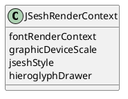
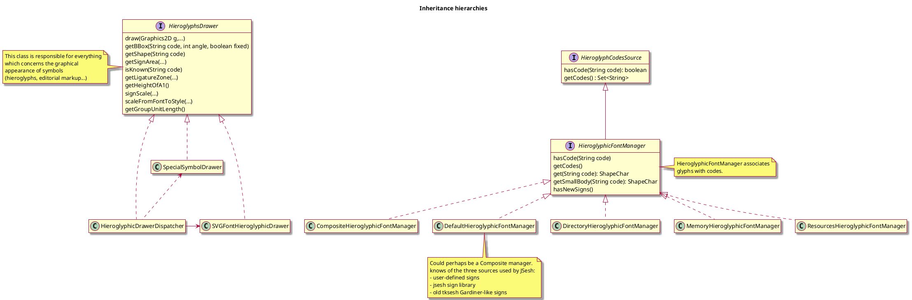

# JSesh developer journal

This journal should only be edited and modified in the Development branch.

## Long Term TODO

- When the software compiles, replace all variable named "drawingSpecifications" by jseshStyle.
- consider removing `depth` in layout;
- when the new version is functional, think about the lifecycle of Layout objects ; it might be interesting to simplify it. They should probably be short-lived objects.
- rename `HieroglyphicFontManager` into **ShapeCatalog** ;
- refactor the whole business around hieroglyphs to make it more logical.

- Note about singletons

  - `ManuelDeCodage` is a singleton. It *could* be annoying if we had different versions of the *Manuel*, but in fact, it does only deal with the basic Gardiner List. We can continue to use a singleton here.

## Simple TODO

- [ ] ❗️❗️Modify `MDCEditorKeyManager` to make its use more transparent. Add an `attach` method, instead of doing everything in the constructor. We don't do it immediately to avoid having one more refactoring to do. We will wait until the present refactoring is complete, and works. 
- [ ] Document what is the scale in `JSeshTechRenderContext`.
- [ ] parametrize each ModelElement class with the type of its possible children.

## 2026/04/10

**Note**: in JSesh 7.x,  `HieroglyphsDrawer` is simply created by calling its default constructor, which will automatically use the user preferences. 

- [ ] currently, some methods of `HieroglyphsDrawer` have only a meaning for hieroglyphs. The symbol font does not handle them. We could split the interface.

## 2026/04/09

**Decision** : don't pass `HieroglyphsDrawer`, pass `HieroglyphicFontManager` instead. 

The problem we are going to face is the following. A `JMDCEDitor` draws the data it needs from a variety of sources.

- `HieroglyphsDrawer` for hieroglyphic fonts (as far as geometry is concerned) ;
- `JSeshStyle` for the way we want to draw things (e.g. size of quadrats, etc.) ;
- `PossibilityRepository` which links translitteration and codes.

The question are : who creates those objects, are they shared, and what are good default values for them? Concerning `JMDCEditor`, it would be nice to have a default constructor with reasonnable default values. It would also be nice to have a **Factory** for creating editors with more advanced values.

Logically, the default constructor should build an instance:

- which uses the standard JSesh font if possible (not the old limited tksesh font) ;
- should be independant of the preferences of the user for JSesh itself.

Specific factories should allow one to create editors using either the user's preference, or to specify what they want.

The current view of the system is available in to file [jsesh.hieroglyphs-V1.md](../UML/jsesh/jsesh.hieroglyphs-V1.md). 

Basically:

- `HieroglyphicFontManager` is the source for glyph shapes; the `DefaultHieroglyphicFontManager` currently uses all possible sources.
- `HieroglyphsDrawer` is in fact used to 
  1. draw signs from a `HieroglyphicFontManager` ;
  2. draw ecdotic symbols ;
  3. choose the size of signs.
   
In the case of HieroglyphsDrawer we have a composite, actual implementation. The only real parameter is the `HieroglyphicFontManager` it uses. Hence, the parameter to pass in the constructor should be a `HieroglyphicFontManager`.

The `JSeshRenderContext` should also hold a `HieroglyphicFontManager`, not a `HieroglyphsDrawer`.

- in `MDCViewUpdater` : should we use a scale which is not $1.0$ for the TechRenderContext? 

## 2026/04/08

### TODO

- TODO: introduce a class for Combobox and lists elements which would allow:
  - stand-in, label only elements (for the first entry)
  - active elements, holding a “true” object. 

## 2026/04/01

- Renamed package `jsesh.hieroglyphs.graphics` into `jsesh.hieroglyphs.fonts`, which is much adequate. 

The changes in the `jsesh` module are almost done. A few new problem appears. We had foreseen them at some point:

~~~java
    // FIXME : choose a reasonable method to share drawing specifications.    
    // Remark : once the drawing specifications are set here, we copy them so only us change them.
    // Think about that.
~~~

The `FIXME` remark was already there in 2012, when we moved the archive from sourceforge to git!

What should we do?

- Introduce a JSeshPreferenceHolder?
- use the MDCEditorKit?

A real problem is that we might want to **share** preferences in some cases, and not in others.

After thinking about this:

- sharing should probably be done mostly when the editors are **created**. Having a default set of preferences, which can be individualy modified afterwards;
- for hieroglyphic fonts, it's a bit more complicated.

We would like:

- in some cases, to have a generic, all-encompassing change.
- for instance, when a user-defined sign is **modified** or **added**, we would like to hear about it;
- in other cases, we could be happy to have two different font sets.

### How are font changes handled in the current system?

Currently, when the preferences dialog is modified, the following code is executed:

~~~java
 /**
     * Sets the application preferences.
     * @param app
     */
    public void updatePreferences(JSeshApplicationModel app) {
        clipboardFormatSelector.updatePreferences(app);
        exportPreferences.updatePreferences(app);
        app.setFontInfo(fontPreferences.getFontInfo());
        otherPreferences.savePreferences();
    }
~~~

Then, `app.setFontInfo` will do :

~~~java
/**
 * Change the fonts used by JSesh.
 *
 * @param fontInfo
 */
public void setFontInfo(FontInfo fontInfo) {
    jseshApplicationBase.setFontInfo(fontInfo);
    for (View v : application.views()) {
        JSeshView view = (JSeshView) v;
        view.setFontInfo(fontInfo);
    }
}
~~~

It will tell each view that its font has been modified.

Finally,  each `JSeshView` (a class in the `jseshAppli`) module, will call:

~~~java
public void setDrawingSpecifications(
        PaintingSpecifications drawingSpecifications) {
    getEditor().setJseshStyle(drawingSpecifications);
    getMdcDocument().setDocumentPreferences(drawingSpecifications.extractDocumentPreferences());
}
~~~

It could be done in an MVC way.

### Current system for characters updates in `DirectoryHieroglyphicFontManager`

Currently, nothing is really done. Modern Java/IO would allow us to watch for file changes.

## 2026/03/24

Regarding the editor part: continue the great hunt for singletons, and pass the objects we need as parameters. 

I consider doing some renaming **(probably after everything compiles), not now**

- The current `JSeshRenderContext` could be renamed to `JSeshProperties` or something like that - in a way, `JSeshStyle` would be a good name ;
- `JSeshRenderContext` would then contain both those information and the `JSeshTechRenderContext`.

The most problematic part is `HieroglyphsDrawer`, because this class is not immutable.

In some cases (for short-lived objects), it's not a problem. For others, notably the editor, we do need to keep track of changes.

## 2026/03/19

- reread what we do with graphicsDeviceScale from TechRenderContext. It might be important when we draw on 4K screens for instance.

Regarding `JSeshRenderContext` and `JSeshTechRenderContext`. Using `JSeshRenderContext`  tends to violate the Demeter principle quite a lot. It's convenient when we need to modify something, but for **reading**, it's somehow cumbersome.

## 2026/03/18

We should avoid letting the code alone for too long. We forgot what we were doing.

updated `ViewDrawer` with `JTechRenderContext`. Some further refactoring would be nice :

- either create records to group most arguments of `drawViewAndCursor` (all of them, in a `DrawRequest` record, simpler groupings.)
- it could also be a good idea to avoid using instance variables of `ViewDrawer` to store what is really function arguments. Grouping them in a record would allow one to pass the easily, and make everything much more explicit.

**What** is `getPointForPosition` doing in `ViewDrawer`? It should somehow be a method of `View`? **Edit**: it's the case in the current system, but in fact, it's brittle, as we depend on position and subviews to be aligned.

- We start working on `GroupEditor`;
- why is `JSeshTechRenderContext` outside of `JSeshRenderContext`? 

## 2025/12/03

I definitly don't like the current structure of `JSeshRenderContext`. For instance, the component for `GroupEditor` needs it. But it's not logical at all. Technically, it can be done, by passing mock or default values for `fontRenderContext` and `graphicDeviceScale`, but it's not very nice.

We could consider splitting `JSeshRenderContext` into two parts:
- `JSeshConfiguration`, containing `jseshStyle` and `hieroglyphDrawer`;
- `JSeshRenderContext`, containing `fontRenderContext` and `graphicDeviceScale`.

- regarding the `GroupEditor` : a new `GroupEditor` is created each time a user edits a group. It's fine, but on the architectural level, it's a bit dangerous, as programmers might think that the `GroupEditor` can be long-lived object. We could change its interface to allow reuse. 

**Trying to split JSeshRenderContext**

- in a number of places, we know the `Graphics` object (for instance, in the drawer). Hence, the `FontRenderContext` should be available without too much trouble. Currently, we pass it. We will not change this immediately, but we must remember to perform an update if possible later. 

## 2025/11/28

Currently, the class JSeshRenderContext has the following structure:

- fontRenderContext: depends on the rendering context, Swing specific, but needed **even for layout,** as text measurement depends on it;
- graphicDeviceScale: depends on the ultimate output;
- jseshStyle: options and the like;
- hieroglyphDrawer: hieroglyphic font source.

In the **external** API, the first two make little sense. It's quite likely that the system will be able to provide them. 

Should we modify the API of `EmbeddableMacPictSimpleDrawer` for instance ?

- Working on `MDCModelTransferable`: lots of parameters if we avoid creating stuff with `new`. We need to figure a cleaner way to use them ;
- `AbtractExportDrawer` : `MDCModelTransferable`, which is in `mdcDisplayer`, depends on it (for copy/paste). In turn, `AbtractExportDrawer` depends on `mdcDisplayer` (because of views). We should do something here (maybe at the level of packages)

- added `setRenderContext` to `AbstractRTFEmbeddableDrawer`, because we need to recompute it at some point. It's not very nice. We should probably have a shorter-lived object for this.
- still about `EmbeddableWMFSimpleDrawer` : the drawing workflow is somehow weird. We should probably polish it to make it stateless ;
- same problem with `RTFExporter` (in this case, the modified rendercontext should be passed to the visitor)
- move `ensureCMYKColorSpace` to JSeshStyle.colors ???
## 2025/11/06

Done : replaced `LigatureManager` by code in `SVGFontHieroglyphicDrawer`. Simplified the system by using JSesh-based coordinates, not the old Tksesh system (which had a different reference system altogether)

Actual use of `LigatureManager` :

only in `Layout`; used in `visitLigature`; calls only one method, which is `ligatureManager.getPositions(codes)`;

- the `LigatureManager` needs the `HieroglyphicFontManager`;
- the `Layout` knows reasonably well the `HieroglyphsDrawer`.

### Inheritance hierarchies of HieroglyphsDrawer and HieroglyphicFontManager

The class `SVGFontHieroglyphicDrawer` draws its signs from a `HieroglyphicFontManager`.

In fact:

- `HieroglyphicFontManager` could be called **ShapeCatalog** ;
- `HieroglyphsDrawer` has a reasonable name.

A note about bounding box returned by `HieroglyphsDrawer`: the `getBBox` methods can handle both fixed a stretchable signs. The current interface is:

~~~java
getBBox(String code, int angle, boolean fixed);
~~~

But it would be more logical if the possible quality of the bbox would be stored in the return value itself.

## 2025/11/05

### Done

- written some tests;

### to consider

- simplify HieroglyphsManager, HieroglyphsDrawer, etc.

### Notes

- bug with ligatures as ligatureManager is null in layout. **It was originally a singleton**
- Consider removing "depth" in layout ?

Concerning the **LigatureManager**: its only use is currently to deal with the **old** tksesh-based ligature (i.e. predefined ligatures like `stp&n&ra`).
It reads a specific file, and is more a dinosaur than anything else. Can it be a singleton? It uses the `HieroglyphicFontManager` to know the sign's bounding boxes. Hence it's linked to the font manager. 

## 2025/11/04

- renamed `RenderContext` as `JSeshRenderContext` to avoid importing wrong class;
- it seems that we **always** need `RenderContext` (there are fonts), `HieroglyphsDrawer` and `JSeshStyle` after all. The simplest solution is to move all of them in `JSeshRenderContext`.

### Notes

- `superScriptDimensions` and `textDimensions` returns respectively a `Rectangle2D` and `Dimensions2D`. This is **not** logical. Think about it.
- I'm not fully convinced of the interest of `PhilologyHelper`.

We have to fit `graphicDeviceScale` somewhere. In the original `DrawingPreferences`, we described it as:

~~~java
 /**
     * Returns the scale of the graphic device, in graphic units per
     * typographical point. This is the scale used by the device if
     * g.getXScale() returns 1.0, not the current scale. Note that we could be
     * lying. In the case of a screen zoom, for instance, we will still provide
     * the original scale.
     * @return 
     */
~~~

Basically, it's the size of a typographical point (`pt`) unit in a *Graphics2D* space whose base scale is 1.0f.

Its **only** use is to decide if we use the **small font** shapes or the **normal shape**, as it depends on the actual rendered size. Its logical place is in the root of the `RenderContext` Object, along with the `FontRenderContext`.

## 2025/11/03

- TODO : look more closely at the uses of `groupUnitLength`, and consider expressing it in the model space, not the inner font space.

- renamed `ColorSpecifications` to `PaintingSpecifications` (see next entry);
- moved `shadingStyle` to `PaintingSpecifications` (more logical);
- in `HieroglyphsDrawer`, `smallBodyUsed` makes the class stateful. It can be removed safely if we add an argument to `HieroglyphsDrawer.draw`.

- **TODO** (cleanup): remove `depth` in Layout. It's not used.
- pass `HieroglyphsDrawer` **and** `RenderingContext` ?
- the `reset()` method in layout is used to set up the JSeshStyle to use. It seems the style could be set elsewhere.

- **check**: what is the best place to apply tag colors ?
- **check if the following code is correct** : 
  
  ~~~java
  if (subView.getHeight() > jseshStyle.geometry().largeSignSizeRatio()
						* hieroglyphsDrawer.getHeightOfA1()) {
  ~~~

  I think we should use `jseshStyle.geometry().standardSignHeight()` instead of `hieroglyphsDrawer.getHeightOfA1`

Note:

- `getGroupUnitLength` in `HieroglyphsDrawer` is not very logical, as signs are scaled to fit the Geometry;

## 2025/10/13

- When updating `QuadratLayout`, we have a problem as `HieroglyphsDrawer` is no longer part of the specifications.
  we need to solve this.

- If we introduce `RenderingContext`, we will need to decide how we pass it, and what it contains.
- I don't see the hieroglyphic fonts being a part of rendering context.

In `Layout`, for small text, we had:

~~~java
	Dimension2D r = drawingSpecification.getSuperScriptDimensions(smallText);
~~~

Now, I'm not sure that the new JSeshStyle class is the right place to have this method, whose old implementation was:

~~~java
public Dimension2D getSuperScriptDimensions(String text) {
    Rectangle2D r = superScriptFont.getStringBounds(text,
            fontRenderContext);
    return new DoubleDimensions(r.getWidth(), r.getHeight());
}
~~~

Technically, it might be done, if we pass the `FontRenderContext` as parameter. But `records` are mostly *pure data holders,* and adding behaviour in records is not a very good idea.

~~~java
record FontSpecification .... {
  public Dimension2D getSuperScriptDimensions(FontRenderContext fontRender, String text) {
    Rectangle2D r = superScriptFont.getStringBounds(text,
            fontRender);
    return new DoubleDimensions(r.getWidth(), r.getHeight());
  }
}
~~~

### Current problems

When fixing the classes in the `layout` package, we find the following problems:

- hieroglyphic font related problem: the method `getHeightOfA1` returns the actual size of the `A1` sign in the current font; this is not supported by `JSeshStyle`;
- we need the `FontRenderContext`;
- we need to compile text size (e.g. getSuperScriptDimensions)
- we need to compile `signScale()`, which depends on the current font **and** on the target size we want in `JSeshStyle`;
- we need the `HieroglyphsDrawer` to find `ligatureZones`, `heightOfA1`;
- we need to compute the bounding boxes of hieroglyphs: `getBBox`;
- we need to compute the width of ecdotic symbols: `getPhilologyWidth`;
- we have `getGroupUnitLength()` which is 1/1000f of the size of `A1`. Currently, it's a bit weird, as it's in `HieroglyphicDrawer`, but if it appears in the `MdC` code, it should probably be computed from `JSeshStyle` and be independant of the font.

## 2025/10/10

TODO : add a RenderingContext parameter, which should **not** be part of JSeshStyle.

  - `JSeshStyle` : the way you want the text to be drawn;
  - `RenderingContext` : the technical constraints you meet.

- (cleaned up master branch), probably not the good time to do this; merged both.
- how to proceed now:
  - start with `mdcDisplayer`
    - fix `layout`, `draw` and `drawingElements`
      - LineLayout and ColumnLayout
      - QuadratLayout
      - anxnb
      - 
    - then move to components and clipboard
  - then fix the rest of jsesh module
  - then the rest of the world.

## 2025/10/08

The current organisation of drawingspecification was not really helpful. It's not obvious to find a given information.
We have made larger groups.

- we keep drawingSpecifications as a name until everything compiles, then it will be jseshStyle.
- we need to replace the lines:

  ~~~java
  drawingSpecifications.getHieroglyphsDrawer().getGroupUnitLength();
  ~~~

  Basically, HieroglyphsDrawer should not be stored in drawingSpecifications (or should they)?

- we have to solve the problem of FontRenderContext. Originaly, it's stored in drawingspecification:

~~~java
FontRenderContext fontRenderContext = drawingSpecifications.getFontRenderContext();
~~~

Now :

- it's initialized with :

~~~java
fontRenderContext = new FontRenderContext(null, true, true);
~~~

So all FontRenderContexts are currently the same.

We **might** want to change it, but it's not probably not correctly placed in drawingSpecifications.

Generally, it's requested from the `Graphics2D` object.

## 2025/10/07

Problem to solve: should the drawing specifications depend on Swing? or should they be stand alone?

- in the first case, some things are easier to write and probably more efficient.
- in the second case, we can more easily move to non-swing rendering if needed later.
- we keep the newEdit package for now. It will probably move to a branch of its own once we have finished this update.
- our new architecture for specification doesn't play very well with DocumentPreferences. It might be interesting to try to fit the two. Currently, it's a blatant violation of the Demeter principle.

## 2025/10/06

- We freeze the structure of the display preferences (`RenderingParameters`) ;
- we will then proceed to write the code ;
- and then, we will refactor them if needed.
- we have removed computed data from the drawingspecifications. They will be provided by helper functions when needed.
-  In the current version, the defaults for pagespec are computed from the other specifications. The whole specification system should be rethought to use independent values.
-  DocumentPreferences are using an outdated architecture. We should move to a record based one.

## 2023/06/07

## 2023/06/06

Analysis and classification of current problem. Planning. See TODO about removing singletons.

## 2023/05/19

We might introduce the notion of BasicMdC codes for codes :

- which appear in Gardiner's grammar ;
- or which have an official phonetic code.

## 2023/05/15

Back to JSesh. Considering :

- simplifying HieroglyphFontManager (which might be a simple code to shape repository), to remove its possible dependency on HieroglyphDatabase ?
- think of introducing a Facade to the whole hieroglyph system in this case.

## 2023/04/25

Well, the mess of singleton is also linked to the question of preferences (not preference files, but in-memory preferences) in the software. 

- investigate variants of Observable and Reactive patterns outside of Swing
- look how it's done in other softwares...

The current question is the granularity of preferences. Should it be large (say, setPreferences/getPreferences, with an immutable 
preferenceValue object, and possibly a preferenceProperty which could be shared), or fine-grained (with a mutable preference object).

**anyway, the first step will be to make everything explicit at constructor level**. We will only use `new` when absolutely mandatory.

## 2023/04/20

Working on cleaning up the mess of Singletons. 

### Hieroglyphic fonts and database

Currently, we have the following system :

~~~plantuml
@startuml
skin rose
interface HieroglyphDatabaseInterface {
    getCanonicalCode(code)
    getCodesForFamily(family, includeVariants)            
    getDescriptionFor(String code)
    getFamilies()
    getPossibilityFor(phoneticValue, level)
    getSignsContaining(code)
    getSignsIn(code)
    getSignsWithTagInFamily(currentTag, familyName)
    getSignsWithoutTagInFamily(familyName);
    getTagsForFamily(familyName)
    getTagsForSign(gardinerCode)
    getValuesFor(gardinerCode)
    getVariants(String code)
    getVariants(String code, variantTypeForSearches)
    getTransitiveVariants(String code, variantTypeForSearches)
    isAlwaysDisplayed(code)
    getCodesStartingWith(code)
    getSuitableSignsForCode(code)
}

class ManuelDeCodage <<singleton>> {
    getTallNarrowSigns()
    getLowBroadSigns()
    getLowNarrowSigns()
    getCanonicalCode(code)
    isKnownCode(code)
    getBasicGardinerCodesForFamily(familyCode)

}

class SimpleHieroglyphDatabase extends HieroglyphDatabaseInterface {
  SimpleHieroglyphDatabase(HieroglyphicFontManager, ManuelDeCodage)
}

HieroglyphicFontManager <- SimpleHieroglyphDatabase
SimpleHieroglyphDatabase -> ManuelDeCodage

interface HieroglyphicFontManager {
	get(code) : ShapeChar
  getSmallBody(code)  : ShapeChar
  getCodes()	
	hasNewSigns()
} 

HieroglyphicFontManager <|-- DefaultHieroglyphicFontManager 
HieroglyphicFontManager <|-- DirectoryHieroglyphicFontManager
HieroglyphicFontManager <|-- CompositeHieroglyphicFontManager
HieroglyphicFontManager <|-- ResourcesHieroglyphicFontManager 

class DefaultHieroglyphicFontManager <<singleton>> {}
@enduml
~~~

Possible changes :

- replace `SimpleHieroglyphicDatabase`, or hide it behind a factory method  ;
- it seems that `SimpleHieroglyphicDatabase` only uses `HieroglyphicFontManager` for its list of codes ; create an interface `CodeRepository` and implement it ?

Make code a class :

~~~plantuml
@startuml
skin rose

abstract class Code {
  {static} Code buildCode(string)
  {abstract} accept(visitor)
}

class GardinerCode extends Code {}
class PhoneticCode extends Code {}
class NumericCode extends Code {}
class OtherCode extends Code {}

@enduml
~~~

## 2020/02/14

- Note for the future : the current package organization of JSesh is illogical.   
   For future versions, we could have :
  - a package for the model (mdc and sundries)
  - a "component" package, with all components
  - each component having its own package.
  - functions which communicate with jhotdraw should do so through a neutral interface
  - "heavy" functions, like "advanced searches", should take advantage of 
  
## 2019/02/22

The git archive is a bit of a mess, as I performed changes on an old version.

- remove dead or unused branches (production and development)
- do more granular changes
- save often (possibly in local archives)
- I'm trying to understand what changes I have done in the fork. I seem 
  to have set the scale to 1.0 systematically. I need to investigate it.
  Some renaming was also involved, but with a very wrong timing. Don't 
  rename outside of the master. I think it had something to do with scaling not working properly.
  
  The temporary branch has many (relatively logical) renames :
  - BaseGraphics2DFactory -> Graphics2DFactoryIF as it is indeed an interface. 
  - TopItemSimpleDrawer -> TopItemDrawer

  

## 2018/10/17

Classes dealt with in our modifications :

### Originaly 
- SelectionExporter : uses ExportData and Graphics2DFactoryIF to
export a selection. 

- TopItemDrawer: used in RTFDrawer, for RTF export

- MdCDrawerTemplate (and subclasses): generic copy class, very similar (if not equals to) 
   TopItemDrawer. Has a slightly better name though.
   

   

## 2018/10/16

I'm trying to clean the graphical export system.
Many things (like quadrat sizes) are computed 
in various places, and it hurts. 

Now, I was looking at the classes in RTFSimpleExporter
(which I'm probably going to rename RTFExporter. Simple does not give any information here.)

A class like EMFSimpleDrawer seems to be a good candidate to encapsulate decisions.
However, it's currently linked to RTF, and with good reasons:
when we output the EMF content in the RTF stream, the way
of encoding it will definitly be different if 
it's EMF and if it's, say, WMF.

- we need an "embedded picture" system
- in which we want to extract the non-RTF part for reuse.

After some reading, the current architecture is not
so bad. The names of classes need to be updated
to fit their actual use. Also, the scaling/sizing
system is flawed. We have two things called CadratHeight
which behave differently : an "inner" height, which
is a question of proportion between signs and quadrat height,
and the actual height in the resulting file.

While renaming, I guess I should rename setShadeAfter, which 
is difficult to understand, as, setDrawShadeOnTop() or 
something like that. Not done at the moment. 
