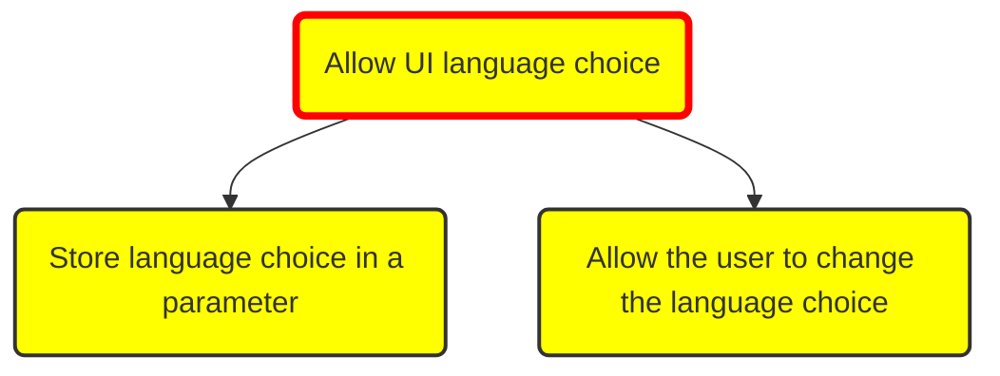
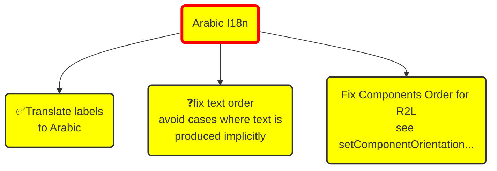

# Attempts of graphs for Mikado Method

**Legend**

- ✅ : done
- ❓ : questionnable goal
- red line : root goal

## Explicit language choice

*Allow users to choose the language of JSesh interface*

## Arabic I18n

Comments

- Arabic i18n is harder than we thought as both right to left text order must be enforced and  
- fixing text order might not be necessary if we fix window layout (but it might be useful for some languages)

## Rationalization of Layout preferences

**Goals**

- make preferences choice explicit
- make preferences immutable to avoid unwanted side effect